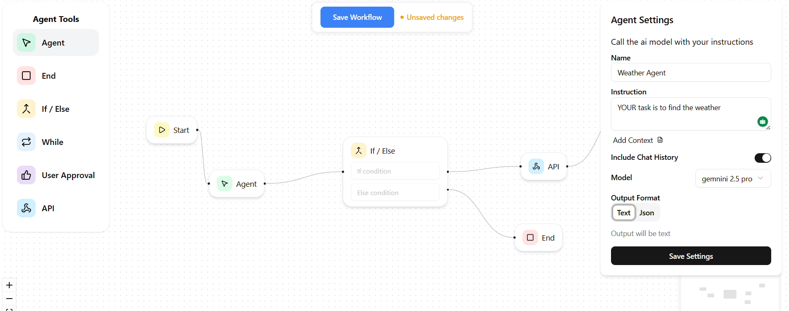
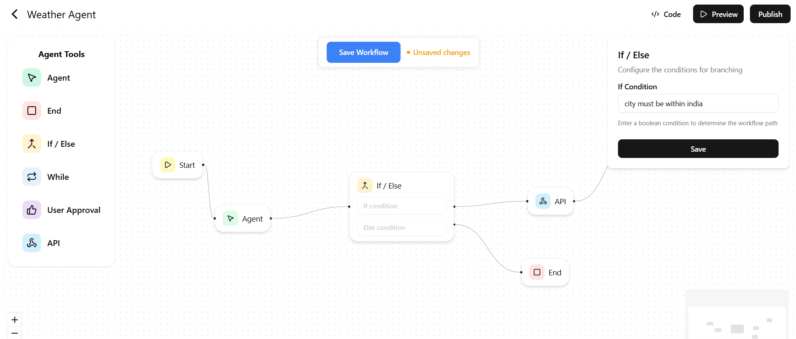
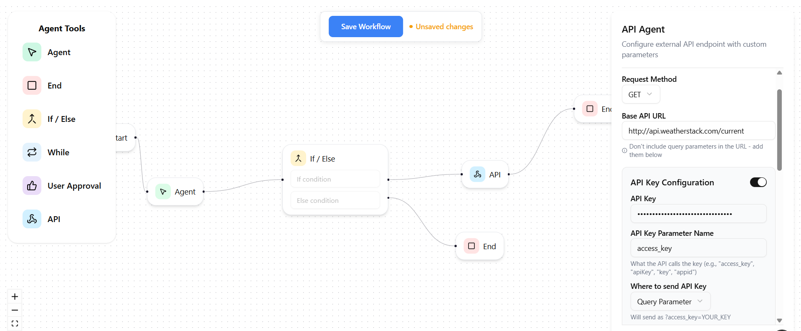
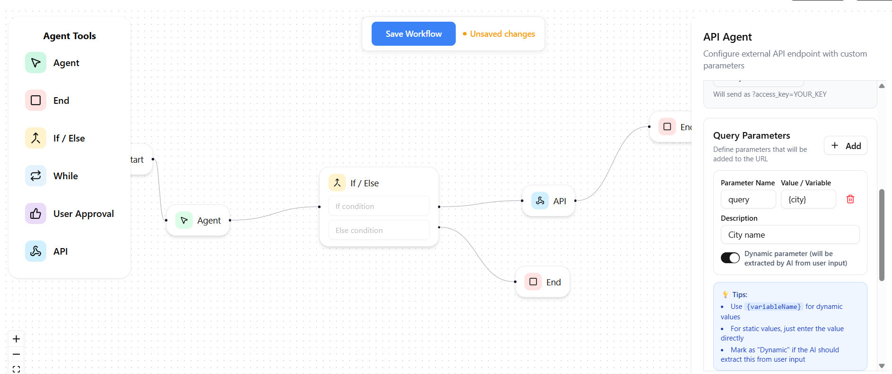
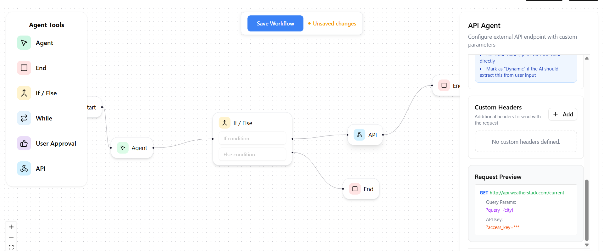
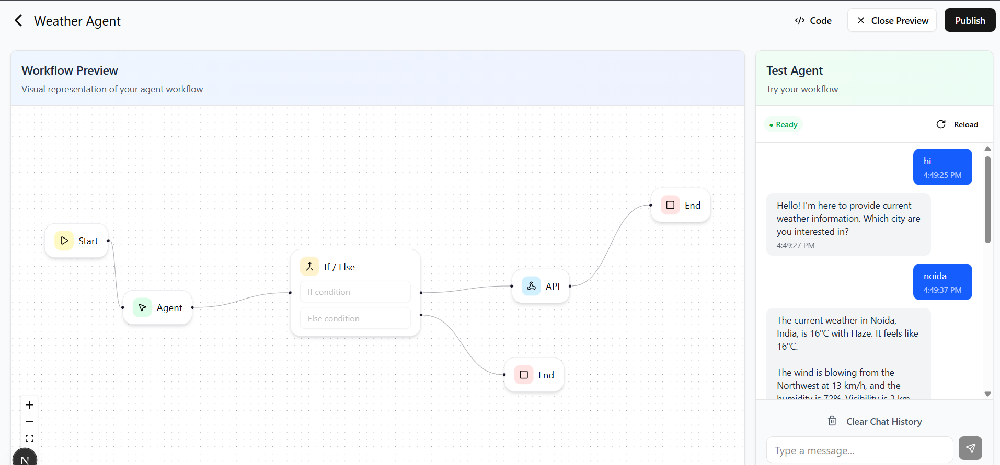

# AgentFlow - No-Code AI Agent Builder

 Build powerful AI agents with visual workflows - no coding required. Connect API calls, add conditional logic, and create custom AI agents through an intuitive drag-and-drop interface.

> **Live :** [agent-flow-dev.vercel.app](https://agent-flow-dev.vercel.app/)

##  What is AgentFlow?

AgentFlow solves a critical limitation of standard chatbots - they can't call APIs or handle conditional logic. With AgentFlow, you can create AI agents that:

-  Make dynamic API calls based on user input
-  Handle conditional branching (if-else logic)
-  Execute complex multi-step workflows
- Integrate with any REST API (GET/POST)

##  Key Features

### Visual Workflow Builder
Drag-and-drop interface powered by React Flow to create complex agent workflows without writing code.

### Real-time Agent Testing
Test your agents instantly with a built-in chat interface. See your workflows come to life in real-time.

### Dynamic API Integration
Connect any REST API with:
- GET/POST methods support
- Query parameters & headers
- API key management (query/header)
- Dynamic parameter extraction
- Request body templates for POST

### Conditional Logic
Add if-else nodes to create intelligent decision-making workflows based on user input or API responses.

### AI-Powered Processing
Integrated with Google Gemini to:
- Extract parameters from natural language
- Format API responses conversationally
- Generate agent configurations automatically

## Tech Stack

- **Frontend:** Next.js 16, React, TypeScript, Tailwind CSS
- **Workflow Engine:** React Flow
- **AI:** Google Gemini 2.0 Flash
- **Database:** Convex (real-time)
- **Auth:** Clerk
- **Security:** Arcjet (rate limiting)

##  How It Works

1. **Build Visual Workflow** - Connect nodes: Start → Agent → API → If-Else → End
2. **Configure Settings** - Set up API endpoints, parameters, and conditional logic
3. **Generate Agent** - AI converts your workflow into executable configuration
4. **Test & Deploy** - Chat with your agent and iterate on the fly

### Architecture Flow
```
User Message
    ↓
ChatUi → /api/chat
    ↓
Gemini decides: Use tool with extracted parameters
    ↓
/api/chat → /api/execute-tool
    ↓
Replace placeholders with actual values
    ↓
HTTP Request to external API
    ↓
API Response
    ↓
Gemini formats response conversationally
    ↓
Display to user
```








##  Use Cases

- **Customer Support Automation** - Integrate with CRM APIs
- **Data Retrieval Agents** - Fetch from multiple data sources
- **Booking & Reservation Systems** - Handle complex conditional flows
- **Real-time Information Bots** - Weather, stocks, news, etc.
- **Workflow Automation** - Multi-step business processes

##  Security & Performance

-  Rate limiting with Arcjet (100 requests/min)
-  Secure API key storage
-  User authentication with Clerk
-  Input validation & error handling
-  Real-time data synchronization

## Project Highlights


- **Node-based architecture** for infinite workflow possibilities
- **AI-powered config generation** - Gemini converts visual flows to executable code
- **Real-time collaboration ready** - Built on Convex's real-time infrastructure
- **Production-grade** - Rate limiting, auth, error handling


---
